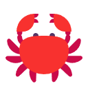

  
  <h1>OpenCrab</h1>
  
<strong>A desktop AI assistant for campus workflows.</strong>

  
<a href="./README-ZH.md">中文</a> | English

  

    
    
    
    
    
    
  

## Overview

Modern student workflows are scattered across chat apps, file folders, calendar tools, and task managers. Important course materials live in one place, deadlines in another, and the assistant you use for studying often cannot see your local documents or schedule.

OpenCrab brings those pieces together in one desktop workspace. It gives students a local-first AI assistant that can chat, read files, manage calendars, automate repetitive tasks, and reuse skills without switching between separate tools.

## Key Features

- **Streaming AI chat**: talk to the assistant with live responses, visible tool calls, and conversation history.
- **File-aware Q&A**: attach local documents and ask questions with the file context included.
- **Web search and web fetch**: search the web for up-to-date information and pull page content into the conversation when you need it.
- **Calendar support**: keep course events, reminders, and custom items in one place.
- **Scheduled tasks**: create prompt-based or script-based automations that run on a schedule.
- **Skills management**: browse, download, upload, and manage reusable agent skills locally.
- **Quiz cards**: turn study content into quick review questions with compact card-style feedback.
- **Desktop integration**: run the app as a Tauri desktop client with native system integration.

## Get the App

### Recommended: Releases

Download a packaged build from the repository [Releases page](https://github.com/sustech-cs304/team-project-26spring-26s-1/releases) when an artifact is available.

### Quick Start

1. Download a release build, or follow the branch README files if you are running from source.
2. Open the app and complete the first-time settings.
3. Configure a model provider or local model endpoint.
4. Start chatting, attach files, or open Calendar and Tasks to explore the rest of the app.

## Usage Scenarios

OpenCrab is designed for everyday campus work, not just casual chat. A few common ways to start:

- Ask for help planning your day:
  `Summarize my classes, deadlines, and top priorities for today.`
- Turn a document into action items:
  `Read this file and give me a short checklist of what I need to do next.`
- Review a course note or handout:
  `Explain the key ideas in this document as if I am reviewing before class.`
- Check your schedule:
  `What should I pay attention to this week based on my calendar?`
- Look up current information:
  `Search the web for the latest official announcement about this topic and summarize the key points.`
- Read a web page in context:
  `Fetch this page and tell me the parts that matter most for a student.`
- Turn notes into review questions:
  `Make 5 quiz cards from this chapter and include the answer for each one.`
- Set up a recurring task:
  `Every Monday morning, summarize my week and list the three most important tasks.`

If you are exploring the app for the first time, start with chat, then try a file attachment or web search, then open Calendar or Tasks to see how the rest of the workspace fits together.

### From Source

The project is split across source branches. Use the branch-specific README files for setup and run instructions:

- Frontend client: [`frontend/README.md`](https://github.com/sustech-cs304/team-project-26spring-26s-1/blob/frontend/README.md)
- Backend runtime: [`backend-new/README.md`](https://github.com/sustech-cs304/team-project-26spring-26s-1/blob/backend-new/README.md)
- Skills Hub admin: [`skillshub-admin/README.md`](https://github.com/sustech-cs304/team-project-26spring-26s-1/blob/skillshub-admin/README.md)

## Project Structure

- [`main`](https://github.com/sustech-cs304/team-project-26spring-26s-1/tree/main): project hub, proposal/design docs, and release workflows
- [`frontend`](https://github.com/sustech-cs304/team-project-26spring-26s-1/tree/frontend): the Vue 3 + Tauri desktop client
- [`backend-new`](https://github.com/sustech-cs304/team-project-26spring-26s-1/tree/backend-new): the FastAPI agent runtime, tools, persistence, and RAG layer
- [`skillshub-admin`](https://github.com/sustech-cs304/team-project-26spring-26s-1/tree/skillshub-admin): the optional skill submission and review service

## RAG Model Compatibility

OpenCrab's cloud knowledge base is built with `BAAI/bge-m3` for embedding and `BAAI/bge-reranker-v2-m3` for reranking. When configuring embedding and rerank models for cloud knowledge-base workflows, use these two models to keep retrieval results compatible with the published index.

---

Copyright © OpenCrab Team
