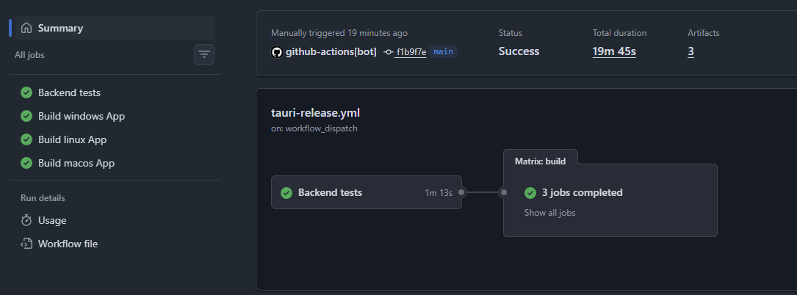

# Team Report

## 1. Metrics

Metrics were computed from the frontend project in `../frontend` and the backend project in `../backend`.

Generated at: `2026-05-25T14:13:15.660927+00:00`

Scope notes:
- LOC counts non-empty lines in source files; vendor, build, generated output, and VCS folders are excluded.
- Cyclomatic complexity is computed with `lizard` for supported source files.
- Dependencies count direct dependencies declared in manifests, not transitive lockfile entries.

| Project | Source files | LOC | Functions | Total CCN | Avg CCN/function | Max CCN | Direct deps |
| --- | ---: | ---: | ---: | ---: | ---: | ---: | ---: |
| frontend | 99 | 16,594 | 650 | 1,722 | 2.65 | 41 | 48 |
| backend | 136 | 19,714 | 1,267 | 3,473 | 2.74 | 45 | 26 |
| total | 235 | 36,308 | 1,917 | 5,195 | 2.71 | 45 | 74 |

Highest-complexity functions observed:
- `backend`: `run._run(job: _ConversationJobState)` in `src/agent/api/conversation_runner.py` with CCN 45
- `frontend`: `cronToHuman(cron: null)` in `src/utils/tasks.ts` with CCN 41

## 2. CI/CD Pipeline Description

The project uses GitHub Actions for CI/CD across the repository root, `../frontend`, and `../backend`.
The `main` branch acts as the release hub: it does not carry application logic, and its workflow is used to run backend tests first and then package the desktop application. Day-to-day frontend and backend deployment flows remain in their own branches.

The release flow is triggered in two ways. First, pushes to `frontend` and `backend-new` run small trigger workflows in those branches, which call the release workflow on `main` through `gh workflow run`. Second, maintainers can run the release workflow manually through `workflow_dispatch` and choose the frontend and backend refs to package.

Pipeline steps and implementation tools:

| Step | Purpose | Tools / technologies |
| --- | --- | --- |
| Trigger release | Start the central release workflow after frontend or backend changes | Branch trigger workflows, GitHub Actions, GitHub CLI `gh workflow run`, default `github.token` |
| Checkout sources | Fetch the selected frontend and backend refs into the release runner | `actions/checkout@v4` |
| Backend dependency setup | Create the backend test environment before packaging | `actions/setup-python@v5`, `astral-sh/setup-uv@v5`, `uv sync --extra dev` |
| Backend tests | Block packaging if backend tests fail | `uv run pytest -q`, `pytest` |
| Frontend build setup | Prepare the web/Tauri client build environment | `actions/setup-node@v4`, `npm ci`, Node.js 22 |
| Rust/Tauri setup | Prepare native desktop build tooling | `dtolnay/rust-toolchain@stable`, `swatinem/rust-cache@v2`, Tauri 2 |
| Backend runtime packaging | Bundle a Python runtime and install the backend package into it | CPython standalone runtime, `pip install ./backend`, `pip check` |
| Desktop packaging | Compile and package runnable desktop artifacts | `npx tauri build`, NSIS on Windows, DEB on Linux, APP/DMG on macOS |
| Artifact publication | Make packaged applications available from the workflow run | `actions/upload-artifact@v4`, GitHub Actions job summaries |

Implemented workflows and tools:
- Release pipeline: [`.github/workflows/tauri-release.yml`](./.github/workflows/tauri-release.yml)
  - Triggered by `workflow_dispatch`; frontend and backend branch trigger workflows call it automatically after branch pushes.
  - Uses `actions/checkout` to fetch the frontend and backend refs, `astral-sh/setup-uv` plus `uv sync --extra dev` and `uv run pytest -q` for backend verification, then `actions/setup-node`, `dtolnay/rust-toolchain`, `swatinem/rust-cache`, `npm ci`, and `npx tauri build` for packaging.
  - Downloads the bundled CPython runtime, installs the backend package into it, stages it for Tauri, and builds release bundles for Windows, Linux, and macOS.
- Frontend release trigger: [`../frontend/.github/workflows/trigger-tauri-release.yml`](../frontend/.github/workflows/trigger-tauri-release.yml)
  - Runs on pushes to `frontend`.
  - Uses GitHub Actions permissions `actions: write` and GitHub CLI `gh workflow run` to trigger the `main` release workflow with `frontend_ref=frontend` and `backend_ref=backend-new`.
- Backend release trigger: [`../backend/.github/workflows/trigger-tauri-release.yml`](../backend/.github/workflows/trigger-tauri-release.yml)
  - Runs on pushes to `backend-new`.
  - Uses GitHub Actions permissions `actions: write` and GitHub CLI `gh workflow run` to trigger the `main` release workflow with `frontend_ref=frontend` and `backend_ref=backend-new`.
- Code metrics pipeline: [`.github/workflows/code-metrics.yml`](./.github/workflows/code-metrics.yml)
  - Uses `actions/checkout`, `actions/setup-python`, `pip`, and the repository script [`.github/scripts/code_metrics.py`](./.github/scripts/code_metrics.py).
  - Installs `lizard` and `tomli`, then generates `summary.md` and `code-metrics.json`, and uploads them as an artifact.
- Frontend deployment pipeline: [`../frontend/.github/workflows/deploy.yml`](../frontend/.github/workflows/deploy.yml)
  - Uses `actions/checkout`, `npm ci`, `npm run build`, and a self-hosted runner.
  - Builds the frontend and copies the `dist` output to `/var/www/opencrab` for Nginx serving.
- Backend CI/CD pipeline: [`../backend/.github/workflows/deploy.yml`](../backend/.github/workflows/deploy.yml)
  - Uses `actions/checkout`, `actions/setup-python`, `uv`, `pytest`, and `docker build`.
  - Runs backend tests on pull requests and pushes, builds a Docker image, and deploys the container on a self-hosted runner for the `backend-new` branch.

Pipeline configuration access:
- [Root code metrics workflow](./.github/workflows/code-metrics.yml)
- [Root Tauri release workflow](./.github/workflows/tauri-release.yml)
- [Frontend release trigger workflow](../frontend/.github/workflows/trigger-tauri-release.yml)
- [Backend release trigger workflow](../backend/.github/workflows/trigger-tauri-release.yml)
- [Frontend deploy workflow](../frontend/.github/workflows/deploy.yml)
- [Backend deploy workflow](../backend/.github/workflows/deploy.yml)
- [Metrics script](./.github/scripts/code_metrics.py)

Pipeline execution proof:

https://github.com/sustech-cs304/team-project-26spring-26s-1/actions

Successful CI/CD run snapshot:

